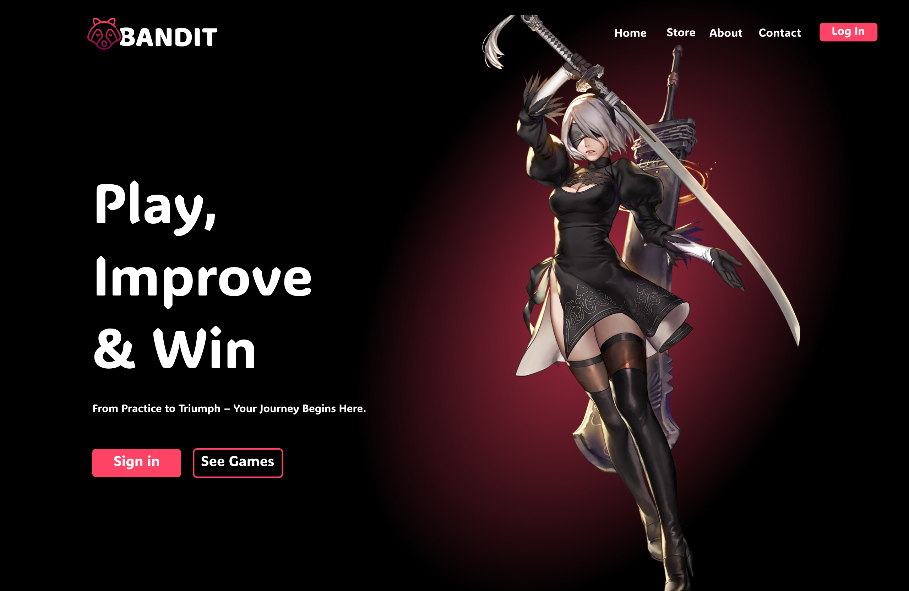

# Demo Video 

# BanditGames  
**A Full-Stack Gaming Platform with Chatbot**  
*Java Spring Boot | React | Azure SQL | RabbitMQ | Keycloack | Python/scikit-learn | Ollama | Azure | Docker*  

---

## Project Overview  
BanditGames is a scalable gaming platform enabling users to play board games, track performance, and engage socially. Built with **microservices** and **event-driven architecture**, it integrates AI/ML for predictive analytics and LLM chatbot.  

---

## Key Features  

### 🎮 Core Platform  
- Real-time two-player board game with WebSocket-based communication  
- Matchmaking lobby and friend system with comparative stats dashboards  
- Achievement tracking via event-driven architecture (RabbitMQ)  

### 🤖 AI/ML Modules  
- RAG-powered chatbot for rule retrieval using LLMs  
- Synthetic player data generation via prompt engineering  

### 📊 Data & DevOps  
- Azure SQL database with complex player/game statistics  
- GitLab CI/CD pipelines with Dockerized Azure deployment  
- Keycloak SSO authentication and Spring Security  

---

## Technology Stack  

